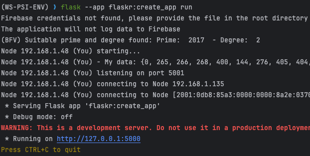
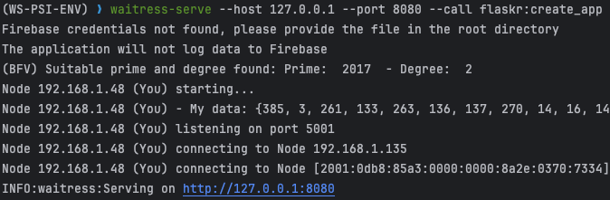
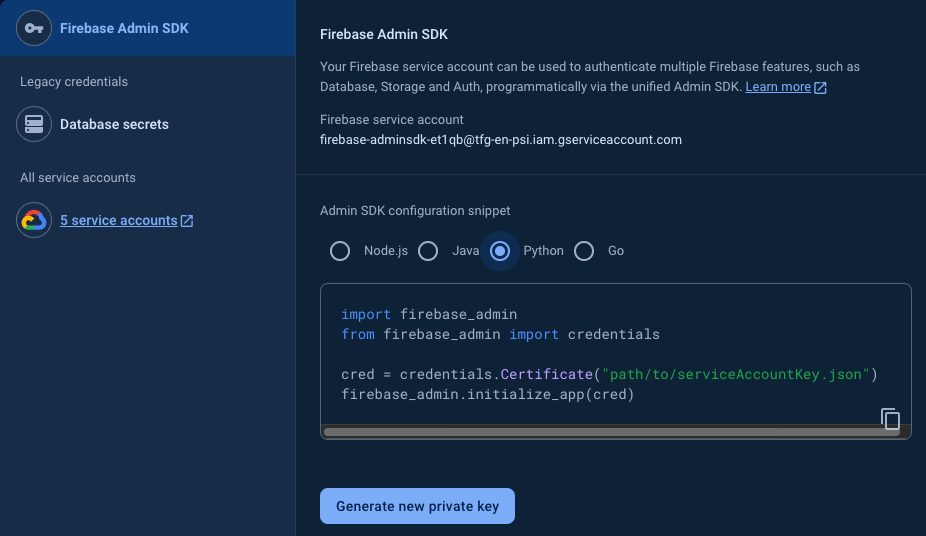
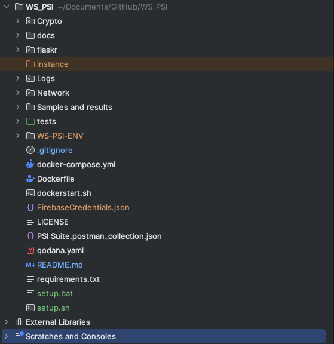
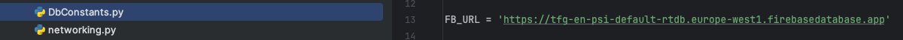
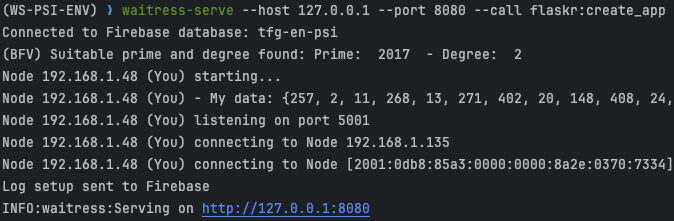
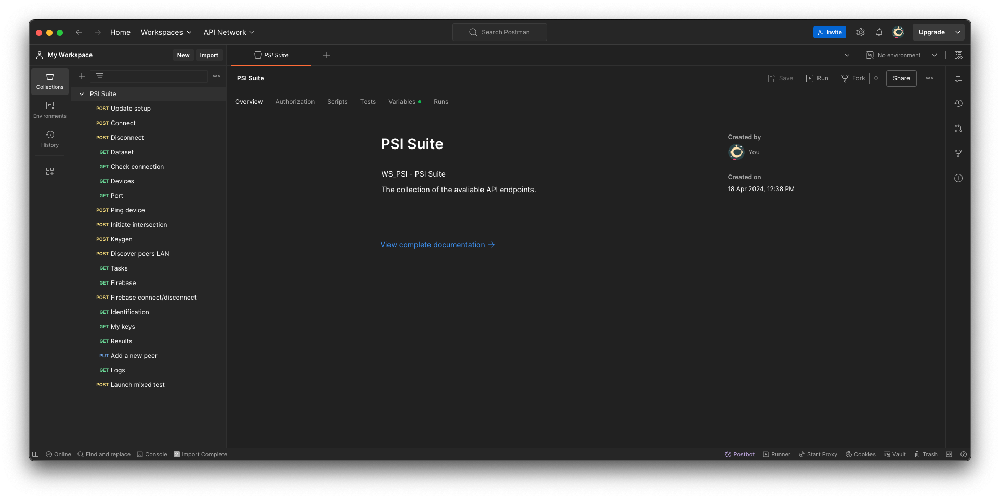
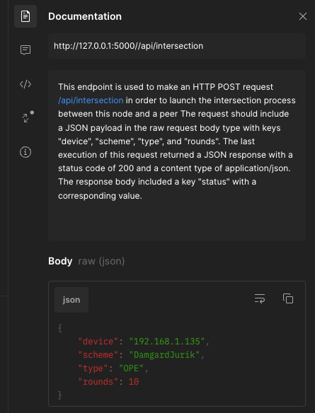

# PSI Suite - Python Web Service
Servicio web de Flask que levanata un nodo y expone una API REST y una interfaz gráfica con el objetivo de probar diferentes criptosistemas y protocolos para calcular PSI (Private Set Intersection) o conjuntos de intersecciones privados.

## Requisitos
* **Python 3.9**
* git
* pip

El sistema ha demostrado funcionar en sistemas ARM y x86. Se ha probado su funcionamiento en Windows y en macOS.

## Arrancar el servicio web

Para arrancar el servicio se pueden seguir estos pasos:

1. Clonar el repositorio: `git clone https://github.com/4rius/WS_PSI.git`. También se puede clonar utilizando el soporte gráfico de GitHub Desktop.
2. Navegar a la carpeta del proyecto: `cd WS_PSI`.
3. Instalar las dependencias, por conveniencia se puede utilizar un entorno virtual de Python:
    1. Crear un entorno virtual: `python -m venv WS-PSI-ENV` en Windows o `python3 -m venv WS-PSI-ENV` en Linux. En sistemas UNIX se recomienda comprobar que `python3` es una versión 3.9 o superior, esto se puede hacer con `python3 --version`. Si no fuera así, se puede instalar y evitar actualizar variables haciendo `python3.9 -m venv WS-PSI-ENV`.
    2. Activar el entorno virtual: `source WS-PSI-ENV/bin/activate` en Linux o `WS-PSI-ENV\Scripts\activate` en Windows.
    3. Instalar las dependencias: `pip install -r requirements.txt`. Y las dependencias para BFV `py-fhe`: `cd Crypto/py-fhe && pip install .` \
Por conveniencia, existe un archivo `setup.sh` que realiza todos estos pasos (para macOS y Linux). Para ejecutarlo, se debe dar permisos de ejecución: `chmod +x setup.sh` y ejecutarlo: `./setup.sh`. Esto solo funciona con Python 3.9.
4. Si no estamos en el entorno virtual (al terminar el script), se debe activar: `source WS-PSI-ENV/bin/activate` en Linux o `WS-PSI-ENV\Scripts\activate` en Windows. Donde `WS-PSI-ENV` es el nombre del entorno virtual.
5. Arrancar el servidor:
   1. Usando el servidor de desarrollo por defecto de Flask: `flask --app flaskr:create_app run`.\

   2. Usando un servidor `waitress` (recomendado): `waitress-serve --host 127.0.0.1 --port 8080 --call flaskr:create_app`
      1. Para instalar `waitress`, se puede hacer con el comando: `pip install waitress`.\
 \
Se recomienda usar `waitress` para evaluar las implementaciones, ya que es más rápido y seguro que el servidor de desarrollo de Flask. Simula mejor lo que sería el rendimiento del sistema en producción.

**Servidor por defecto**\
La API REST quedará expuesta en la dirección `http://127.0.0.1:5000/api` y la interfaz gráfica en `http://127.0.0.1:5000/`. \
Se puede modificar el puerto y la dirección de la API en el arranque del servidor. Ejemplo: `flask --app flaskr:create_app run --port=8000`. La dirección cambiaría con `--host=OTRA_DIRECCION` aunque puede que no se pueda asignar.\
**Servidor `waitress`**\
La API REST quedará expuesta en la dirección `http://127.0.0.1:8080/api` y la interfaz gráfica en `http://127.0.0.1:8080/`. \
Se puede modificar el puerto y la dirección de la API en el arranque del servidor. Ejemplo: `waitress-serve --host 127.0.0.1 --port 8000 --call flaskr:create_app`\

El nodo por defecto empezará a escuchar en el puerto 5001, pero se puede cambiar mediante la API. Siempre correrá en la IP local para que otros usuarios de la red local puedan conectarse a él. Este comportamiento es *modificable* por si se quisiera exponer a internet, pero **no está parametrizado**.

## Autenticación mediante archivo de credenciales

Para poder mandar registros a la Realtime Database es necesario un archivo de credenciales.\
Para obtenerlo, se debe seguir los siguientes pasos:
1. Acceder a la consola de Firebase: [Firebase Console](https://console.firebase.google.com/).
2. Crear un nuevo proyecto o seleccionar uno existente.
3. Ir a la sección de configuración del proyecto.
4. Descargar el archivo de credenciales en formato JSON desde la sección de *Cuentas de servicio*.\
\
5. Guardar el archivo en la carpeta raíz con el nombre `firebase-credentials.json`. *Este archivo proporciona acceso de administrador al proyecto.* **No se debe subir a ningún repositorio público**. Se debe añadir al `.gitignore` para evitar subirlo por error. \

6. Actualizar el valor del parámetro `FB_URL` en el archivo `Network/collections/DbConstants.py` con la URL de la Realtime Database.\

7. Volver a arrancar el servidor. En vez de indicar que no se ha encontrado el archivo de credenciales, se mostrará un mensaje de que se ha conectado a la base de datos correctamente y se enviará el primer log con la configuración del dispositivo.\

8. Si la Realtime Database está configurada correctamente, se enviarán registros sin problema. Solo es necesario activarla para que funcione.

## API REST

Se incluye en este repositorio una colección de Postman con las peticiones a la API REST.\
Para importarla, se debe seguir los siguientes pasos:
1. Descargar el archivo `PSI Suite.postman_collection.json` desde la carpeta `docs`.
2. Abrir Postman.
3. Ir a la sección de colecciones.
4. Importar la colección descargada.
5. Seleccionar el archivo descargado.
6. La colección se importará correctamente.\

En el apartado de `Variables` se pueden modificar las variables de entorno para que se ajusten a la configuración del servidor. Por defecto traen la URL y el puerto del servidor de desarrollo de Flask, así como un dispositivo para probar las peticiones. \
Cada petición tiene una descripción detallada de lo que hace y qué espera recibir para funcionar correctamente. \

## Despliegue Docker
El código proporcionado contiene todo lo necesario para crear una imagen de Docker y levantar servicios independientes en la misma máquina utilizando Waitress.
Para crear la imagen es necesario contar con el demonio de Docker que haya disponible para la máquina en que se esté trabajando.
- Ir a la raíz del repositorio y ejecutar el comando `docker build -t ws-psi .`
-  Una vez creada la imagen, en el mismo directorio, se puede ejecutar `docker compose up`
El archivo `docker-compose.yml` está configurado para crear 4 servicios bajo la misma red de Docker, luego estos se podrán conectar entre ellos como si se tratase de una red de área local.
Para parar el servicio se puede mandar el comando `docker compose down` o utilizar el atajo `CTRL + C`.
Para eliminar los contenedores y que no consuman recursos, se puede utilizar el comando `docker rm $(docker ps -aq)`.

## Licencia
Este proyecto está distribuido bajo la licencia MIT. Para más información, consultar el archivo [LICENSE](LICENSE).
